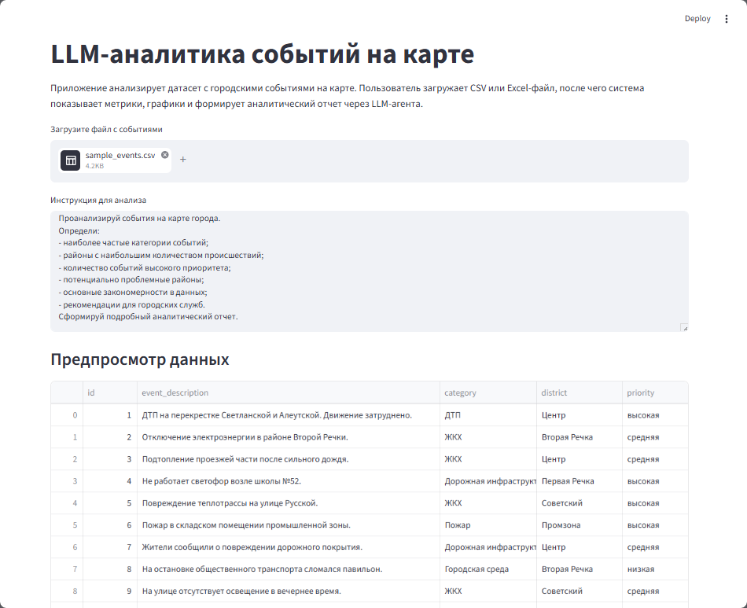
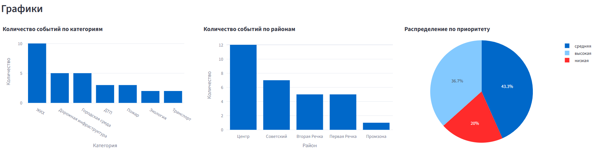
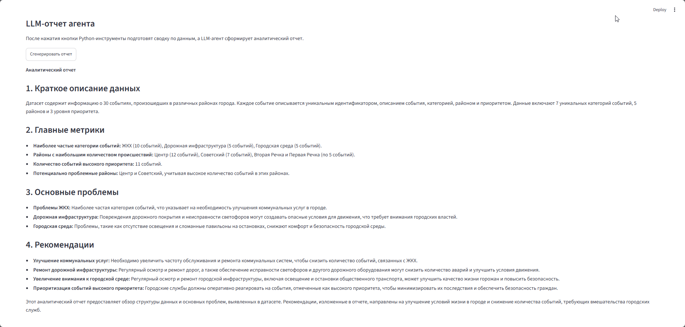

# Задание 3 — Мини-продукт с LLM-аналитикой

Веб-приложение на Streamlit для анализа датасетов с помощью LLM-агента.

Пользователь загружает CSV или Excel-файл, пишет инструкцию для анализа, после чего приложение:

- читает датасет;
- рассчитывает ключевые метрики;
- строит графики;
- вызывает LLM через Groq API;
- возвращает аналитический отчет, инсайты и рекомендации.

## Запуск

Установить зависимости:

```bash
pip install -r requirements.txt
```
Создать файл `.env`:

```env
GROQ_API_KEY=your_api_key_here
MODEL=llama-3.3-70b-versatile
```

Запустить приложение:

```bash
streamlit run app.py
```

После запуска откроется веб-страница, куда можно загрузить CSV или Excel-файл.

## Скриншот работы


1. Загрузка файла и предпросмотр данных  
   
2. Построенные графики  
   
3. Финальный отчёт  
   

---